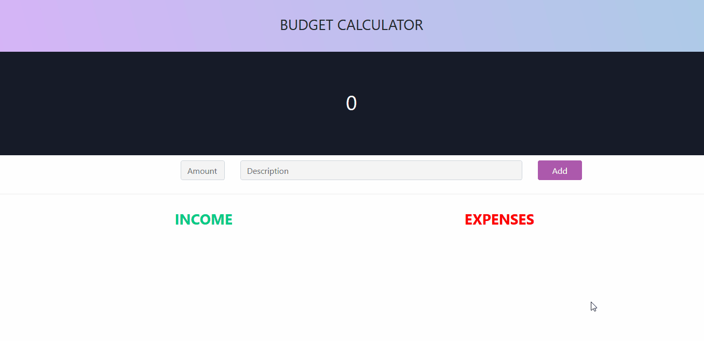
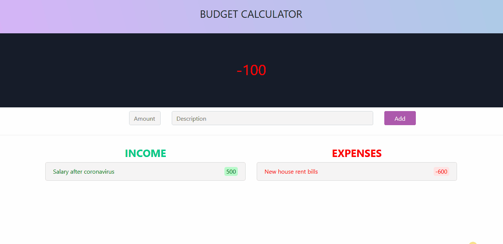
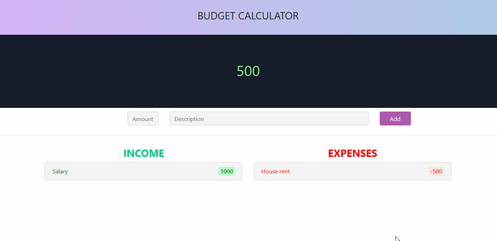

# Budget Calculator App
### Introduction

This project was my first experience with Angular framework.  During the development i have strengthen my knowledge in some areas of Angular, for example:

1. I learned more about component's interaction between each other (**Input** and **Output** decorators, **EventEmitters**).
2. Used on practice some Bindings and developed better confidence in this concept.
3. Learned more about interaction with forms(**ngModels** and **ngForms**).
4. Learned about Angular animations and how they work.  
5. Became more familiar and confident with **TypeScript** syntax.
6. Learned basic concepts of Bootstrap.

### Project description

The idea, **not code** (except colors), of this project was taken from YouTube channel **Devstackr**. The main concept is to have a calculator, where you can add the positive or negative amount of your month expenses, accompanied with the description and track what will be the final amount during some undefined period.

Among the functions of the application:
1. **Add amount with the description:**

2. **Edit amount or description:**

3. **Delete amount:**

### Epilogue
Although the project was not very huge or challenging, i consolidated my existing knowledges and learned a lot of new aspects during the coding.
